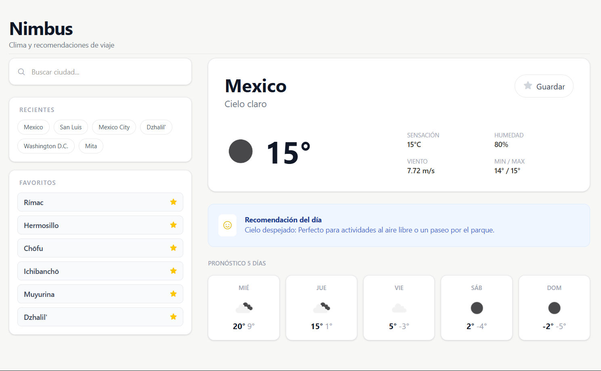

# ☁️ Nimbus | Clima y Viajes

**Nimbus** es una aplicación web moderna y minimalista diseñada para consultar el estado del tiempo en cualquier ciudad del mundo. Su enfoque principal es la experiencia de usuario, ofreciendo no solo datos meteorológicos precisos, sino también recomendaciones personalizadas basadas en las condiciones actuales para planificar actividades.

## Funcionalidades Principales

* **Búsqueda Global en Tiempo Real:** Localización de ciudades mediante la API de Geocodificación de OpenWeather, con un sistema de sugerencias predictivas mientras escribes.
* **Reporte Meteorológico Detallado:** Visualización de temperatura actual, sensación térmica, humedad, velocidad del viento y valores extremos (mín/máx).
* **Pronóstico de 5 Días:** Panel informativo con la evolución del clima para la semana, incluyendo iconos descriptivos y temperaturas.
* **Sistema de Recomendaciones Inteligentes:** Sugerencias dinámicas según el clima (ej. visitar museos en días lluviosos o pasear por el parque en días despejados).
* **Gestión de Favoritos:** Permite guardar tus ciudades recurrentes en el almacenamiento local (`localStorage`) para un acceso rápido.
* **Historial de Búsquedas:** Registro automático de las últimas 6 ciudades consultadas para facilitar la navegación rápida.
* **Diseño Adaptable (Responsive):** Interfaz optimizada para dispositivos móviles y escritorio utilizando **Tailwind CSS 4.0**.
* **Persistencia de Datos:** La aplicación recuerda la última ciudad consultada para mostrarla automáticamente al cargar la página.

## Tecnologías Utilizadas

* **HTML5 / JavaScript (ES6+):** Lógica asíncrona mediante `fetch` y `async/await`.
* **Tailwind CSS 4.0:** Estilizado moderno y animaciones personalizadas.
* **OpenWeather Maps API:** Fuente de datos meteorológicos y geolocalización.
* **Phosphor Icons:** Iconografía clara y minimalista.

## Configuración

Para utilizar este proyecto localmente, asegúrate de tener una clave de API válida de [OpenWeather](https://openweathermap.org/api):

1.  Clona el repositorio.
2.  Abre el archivo `app.js`.
3.  Reemplaza el valor de `const API_KEY` con tu propio token.
4.  Ejecuta el archivo `index.html` en tu navegador.

## Deployado

https://nimbus-navy-nine.vercel.app/ 

## Imagen del proyecto

